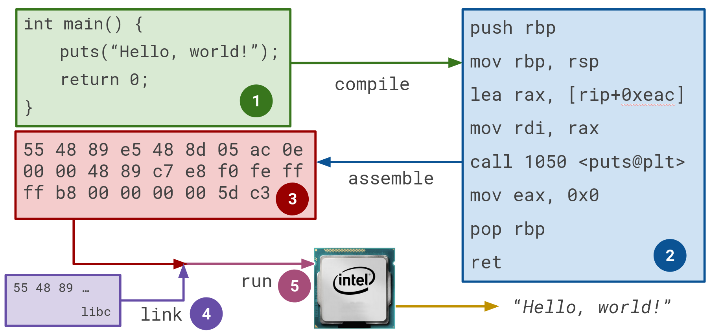
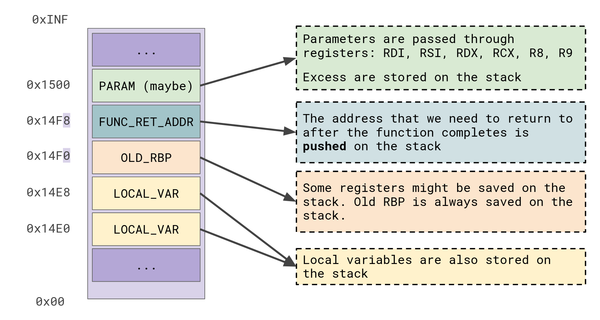

# Laboratory 0x01 - Virtual Memory and Processes

When managing the memory of a computer, the operating system uses a technique called "virtual memory". This technique gives each process the illusion that they have access to a very large memory pool, reserved just for them. In reality, virtual memory is a group of memory chunks (called pages), that are each mapped to the real physical memory, be it either Random-Access Memory (RAM) or Disk Space (also called swap space). If a page is accessed, but is not currently mapped in RAM (it is on Disk), then the program generates a *page fault*, that gets caught by the kernel. Then the kernel maps that page into RAM.


*(Source for the right side of the picture: https://upload.wikimedia.org/wikipedia/commons/thumb/6/6e/Virtual_memory.svg/500px-Virtual_memory.svg.png)*

## Exercise 1 - Inspecting Virtual Memory

Let's see how a program is loaded into memory from disk. On Linux, executables are usually in the Executable and Linkable Format (ELF). On Windows, the usual format is called Portable Executable (PE). Both have metadata that instructs the operating system how to read and find each part of a program, like data or executable instructions. The data and metadata are kept in *sections*. Some of the most common and interesting sections of an ELF file are:
* .bss -- containing global variables that are uninitialized, or are initialized with zero.
* .data -- containing global variables that are initialized.
* .rodata -- containing read-only data, like constants and strings.
* .text -- containing executable instructions (bytecode).

If you wish to look at some beautiful dissections of ELF or PE, check out [corkami's pics](https://github.com/corkami/pics). Here's the [ELF dissection](https://github.com/corkami/pics/blob/master/binary/elf101/elf101.pdf) and the [PE dissection](https://raw.githubusercontent.com/corkami/pics/master/binary/pe101/pe101-64.png).

Compile `ex1.c` with `make ex1`. The source code is basically just an infinite loop, so we can inspect the process that spawns when running the program. To inspect the process, we require some way to attach to it, like a debugger. For all the labs presented we will make extended use of good ol' `gdb`. You will learn how to use it efficiently to inspect processes and craft exploits. Fortunately, we're not crazy, we will be using a modernized version of it. There are 2 main well-known and used plugins that modernize gdb for exploitation:
* [GDB Enhanced Features (GEF)](https://github.com/hugsy/gef)
* [pwndbg](https://github.com/pwndbg/pwndbg)

Both of them are great and pretty similar to each other. You are free to choose whatever you wish, but I personally recommend `pwndbg`, as it has a bit more features. It has its disadvantages, it can be a bit more bloated and it has a lot of on-screen information.

You can install `GEF` with *one* of the following:

```
# via the install script
## using curl
$ bash -c "$(curl -fsSL https://gef.blah.cat/sh)"

## using wget
$ bash -c "$(wget https://gef.blah.cat/sh -O -)"

# or manually
$ wget -O ~/.gdbinit-gef.py -q https://gef.blah.cat/py
$ echo source ~/.gdbinit-gef.py >> ~/.gdbinit

# or alternatively from inside gdb directly
$ gdb -q
(gdb) pi import urllib.request as u, tempfile as t; g=t.NamedTemporaryFile(suffix='-gef.py'); open(g.name, 'wb+').write(u.urlopen('https://tinyurl.com/gef-main').read()); gdb.execute('source %s' % g.name)

```

You can install `pwndbg` with the bundled install script:

```
$ git clone https://github.com/pwndbg/pwndbg
$ cd pwndbg
$ ./setup.sh
```

After you install any of them, open a new terminal (or a terminal tab) and attach to the process:
```
$ sudo gdb -p $(pgrep ex1) -x ~/.gdbinit
```
Depending on whether you chose `GEF` or `pwndbg`, you might be seeing the current state of the process, with its registers, disassembly of the current instructions, etc... If you don't see it, try out the `context` command.

You can type `vmmap` to check out the virtual memory mapping. You should see something like this, but colored nicely:
```
             Start                End Perm     Size Offset File
          0x400000           0x401000 r--p     1000      0 /bin/ex1
          0x401000           0x402000 r-xp     1000   1000 /bin/ex1
          0x402000           0x403000 r--p     1000   2000 /bin/ex1
          0x403000           0x404000 r--p     1000   2000 /bin/ex1
          0x404000           0x405000 rw-p     1000   3000 /bin/ex1
    0x7f8ecce00000     0x7f8ecce28000 r--p    28000      0 /usr/lib/x86_64-linux-gnu/libc.so.6
    0x7f8ecce28000     0x7f8eccfbd000 r-xp   195000  28000 /usr/lib/x86_64-linux-gnu/libc.so.6
    0x7f8eccfbd000     0x7f8ecd015000 r--p    58000 1bd000 /usr/lib/x86_64-linux-gnu/libc.so.6
    0x7f8ecd015000     0x7f8ecd016000 ---p     1000 215000 /usr/lib/x86_64-linux-gnu/libc.so.6
    0x7f8ecd016000     0x7f8ecd01a000 r--p     4000 215000 /usr/lib/x86_64-linux-gnu/libc.so.6
    0x7f8ecd01a000     0x7f8ecd01c000 rw-p     2000 219000 /usr/lib/x86_64-linux-gnu/libc.so.6
    0x7f8ecd01c000     0x7f8ecd029000 rw-p     d000      0 [anon_7f8ecd01c]
    0x7f8ecd1e7000     0x7f8ecd1ea000 rw-p     3000      0 [anon_7f8ecd1e7]
    0x7f8ecd20a000     0x7f8ecd20c000 rw-p     2000      0 [anon_7f8ecd20a]
    0x7f8ecd20c000     0x7f8ecd210000 r--p     4000      0 [vvar]
    0x7f8ecd210000     0x7f8ecd212000 r-xp     2000      0 [vdso]
    0x7f8ecd212000     0x7f8ecd214000 r--p     2000      0 /usr/lib/x86_64-linux-gnu/ld-linux-x86-64.so.2
    0x7f8ecd214000     0x7f8ecd23e000 r-xp    2a000   2000 /usr/lib/x86_64-linux-gnu/ld-linux-x86-64.so.2
    0x7f8ecd23e000     0x7f8ecd249000 r--p     b000  2c000 /usr/lib/x86_64-linux-gnu/ld-linux-x86-64.so.2
    0x7f8ecd24a000     0x7f8ecd24c000 r--p     2000  37000 /usr/lib/x86_64-linux-gnu/ld-linux-x86-64.so.2
    0x7f8ecd24c000     0x7f8ecd24e000 rw-p     2000  39000 /usr/lib/x86_64-linux-gnu/ld-linux-x86-64.so.2
    0x7ffd7592f000     0x7ffd75950000 rw-p    21000      0 [stack]
0xffffffffff600000 0xffffffffff601000 --xp     1000      0 [vsyscall]
```
You can also access this information in the `proc` filesystem, that holds data on processes. Check out `/proc/$(pgrep ex1)/maps`.

So what are we looking at? The ELF sections mentioned earlier are mapped into *segments* of memory, marked with different protections based on the needs of each section. For example, `.rodata` will be mapped into a segment protected with read-only permissions. On the other hand, `.data` and `.bss` will be mapped into the same segment, protected with read-write permissions. You can see the file that is mapped in memory in each segment.

**[Q1]**: Where is each section mapped? Try using the `search` command in `pwndbg` (or `search-pattern` in `GEF`).

**[Q2]**: Try finding the address of `foo()` in gdb and printing its disassembly.

What about the other files in `vmmap`? You are for sure familiar with the concepts of *libraries*. Most of the other segments are mapped libraries, but there are also some other special memory segments, like the `stack` or the `heap`, which are not actually filled up with useful values all the time. The other segments are all mapped from files, while these special segments have their memory reserved for *dynamic use*. All these segments are actually allocated using the [mmap](https://www.man7.org/linux/man-pages/man2/mmap.2.html) syscall. We'll talk about the `stack` and the `heap` later. First, let's have some fun with `mmap`.

## Exercise 2 - Baby's first executable loader

Quick reminder: When we are talking about executable instructions, we are talking about "bytecode" -- a sequence of bytes that the CPU reads and executes. All executable code on the computer gets at some point or another translated to this bytecode, as it's the only thing the CPU understands. Essentially, all high-level languages need to be translated to this. Usually, the *compilation process* does this, going from high level language (C) --(to)--> low level language (assembly) --(to)--> bytecode. For the course and lab, we are mostly going to use the x86\_64 architecture as a backbone for everything we do. If you need to know anything about its assembly language, I recommend the [Intel Software Developer's Manual](https://www.intel.com/content/www/us/en/developer/articles/technical/intel-sdm.html) and a site for looking up instruction mnemonics easier, like [this one](https://www.felixcloutier.com/x86/).



The reverse of the compilation process (assembly -> high-level language) is called *decompilation*. The reverse of the assembly process (bytecode -> assembly) is called *disassembly*.

Executable files are parsed by a program called a *loader*. In Linux, the ELF loader is implemented in the kernel (specifically in `fs/binfmt_elf.c`, [link here](https://elixir.bootlin.com/linux/latest/source/fs/binfmt_elf.c)). Basically, by looking at the ELF header and metadata, a loader can properly map the files in memory. We can create a mock-up of that -- let's open an executable file, find the offset for a function, allocate an executable region with `mmap` and then copy the bytes for the function to the executable region and jump to it.

Here are some tips on how to do it:
* You can find offsets to certain functions with `objdump -d binary name -F`. `-F` is for printing file offsets.
* You can also open an executable with `gdb` and print the address for the function. Then you can subtract the address that the file is starting to be mapped at. For example, if `foo()` is at `0x401337` and the start of the file in memory is `0x400000`, then `foo()` is at offset `0x1337` from the beginning of the file.
* You can open a file with `fopen()` and go to that offset to start copying the amount of bytes needed for the function.
* Allocate an executable region with `mmap`. Don't forget to set the right protections, check the man page.
* Jump to the code and execute.
* Compile `dummy.c` and then you can use `./bin/dummy`. Copy the `foo()` function.
* You can also `mmap` the file directly in memory if you're cool ;)

There's a small template for it in `ex2.c`.

**[Q3]**: Check `gdb` with your binary. How does `vmmap` look after running `mmap`? You can step through each line of code with `next` or `n`. You can step through each assembly instruction with `next instruction` or `ni`.

To see each line of assembly being executed by `foo()`, you can step into the function pointer call with `step instruction`, or `si`.

## Exercise 3 - Stacks, calling conventions and mind controlling execution

What's up with stacks? You might have already seen the *stack* printed in the `GEF` and `pwndbg` context. Variables you declare in functions are allocated on the stack segment, as you've probably learnt in your Computer Architecture classes. The stack is important for managing each function's *frame* and maintaining control flow data essential for program execution. What does that mean? Whenever you call a function directly, the generated assembly instruction is `call` ([man here](https://www.felixcloutier.com/x86/call)). When executed, this instruction automatically pushes the next instruction's address on the stack. At the end of each function, there is a high chance of encountering a `ret` (return) instruction, that automatically pops this return address and moves execution to it. The expression "*moving execution*" refers to changing the value of the `RIP` register. The CPU has multiple very fast storage units called *registers*. You can think of them as variables. Some of them are normal and used for operations, some have special properties. One of these special ones is `RIP`, or the `Instruction Pointer`, that can only be changed through control flow instructions -- like `call`, or `ret`, or `jmp`!

Additionally, whenever the compiler sees a function call, it must generate assembly that follows the *calling convention* of the system. That's just an agreement of how to pass arguments and who cleans up the stack frame. Ideally, every function call should leave the stack in the same way it was before the call. Below you can see an explanation of how the calling convention for Linux x86\_64 works:




So, for example, if I call `bar(a, b, c)`, the generated assembly will look something like this:

```asm
mov rdi, a;
mov rsi, b;
mov rdx, c;
call bar;
```

Take a look at `ex3.c`. Compile it with `make ex3` and check out its disassembly.

**[Q4]**: Can you identify the arguments of a function call in the disassembly?

Now that we know about the calling convention, let's play with it. With a debugger, you can choose to change whatever registers you want, whenever you want. Using the `set` command in `gdb`, try calling a function that isn't called in `ex3.c`, with arguments chosen by you. Make it obvious that you chose the arguments.

**[Q5]**: Did you get a `SIGSEGV` in `printf()`? What causes it? `pwndbg` hints at the reason.

## Extra Challenges

Each lab will also have some extra fun challenges that expand on each exercise, to give you an opportunity to explore more for an exercise you liked. You can get extra points for them. Here they are:

1. **Filesystem Crawler** -- Check out what other things the `/proc/` filesystem offers. Some of the stuff there can be really helpful in exploitation. Can you find an information leak that could be useful in a web exploitation context?
2. **ELF Pro** -- Try writing an ELF parser for the header and some metadata (like sections), following the [format specification](https://flint.cs.yale.edu/cs422/doc/ELF_Format.pdf). There are already [some structures](https://www.man7.org/linux/man-pages/man5/elf.5.html) in Linux that can help you out.
3. **Control-flow Trickster** -- Can you call a more interesting function, that is not even in the source code? How can you do it without setting `RIP` directly?
