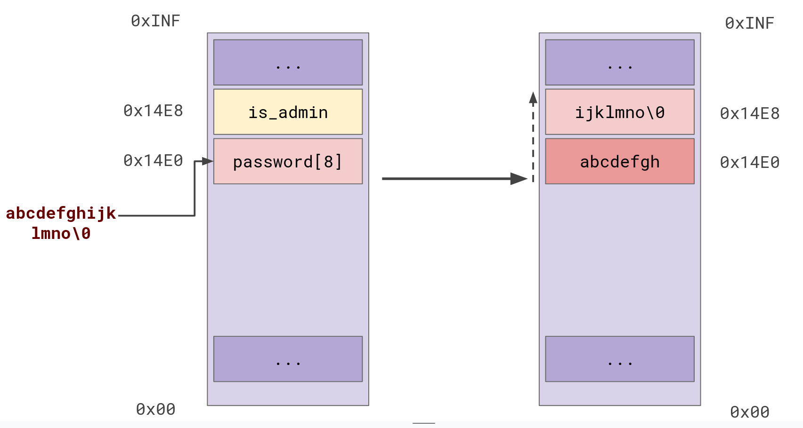
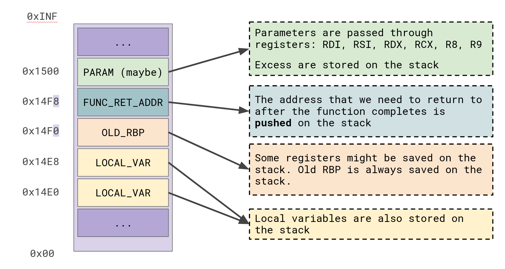

# Laboratory 0x02 - Smashing Stacks & pwntools

Ah, yes, the legendary **buffer overflow**. The most infamous vulnerability in history. Kicked off into the "mainstream" security scene by Aleph One (or Elias Levy) with his Phrack article "*Smashing The Stack For Fun and Profit*", buffer overflows have been the plague of software since the dawn of C programming. While stack-based buffer overflows still hold potential today, their capability is heavily limited by modern binary-level protections. These are mechanisms usually introduced by compilers or by the operating system to protect programs from such bugs. Examples include *stack cookies*, *address space layout randomization*, *w^x bit*, *shadow stacks*... The list goes on.

In this laboratory, we shall reproduce and understand a classic buffer overflow attack. We will be using a technique called *code-reusing* initially and then later explore crafting *shellcode*, similarly to the Phrack article. Additionally, we will be learning the widely-used exploitation framework *pwntools*, to help us mount an attack easier, faster and automated.

Note: All the programs we are exploiting will be compiled for 64-bits. We will be temporarily compile without stack cookies, which is one of the protections used by compilers, to simplify the process.

At this point, we should check out [pwntools](https://github.com/Gallopsled/pwntools) and its [documentation](https://docs.pwntools.com/en/stable/). If you're on a Debian derivative, you can install it with the instructions found on the repo:

```
$ sudo apt-get update
$ sudo apt-get install python3 python3-pip python3-dev git libssl-dev libffi-dev build-essential
$ python3 -m pip install --upgrade pip
$ python3 -m pip install --upgrade pwntools
```

Otherwise, you can just install the prerequisites with your distribution's package manager and then install pwntools with `pip install pwntools`.

### What is a buffer overflow?

Simply put, a buffer overflow is when you try to copy more data into a memory location (buffer) than that memory is supposed to hold. For example, if you try to input MORE than 8 characters into a buffer of 8 characters, the copy operations to that buffer *might* continue copying past the end of it. What *past the end* means is that the extra bytes will be copied *up* the stack. The following image presents an example of a buffer overflow that overwrites adjacent value `is_admin` on the stack:



**[Q1]**: Can you imagine a scenario where this would affect a program's behavior?

## Exercise 1 - Buffer Overflow to bypass authentication

For the first exercise (`ex1.c`), we will be using the scenario you imagined at the previous question. The stack contains a variable that maintains the admin status of the current user. A user is made admin only if they know a secret password.

**[Q2]**: Can you bypass the check that "grants you access", without knowing the secret password?

Note that when compiling, the stack layout does not always follow the declaration order of the source code. Variables may be moved depending on their type, or they can be padded to keep the stack aligned to 16 bytes.

**[Q3]**: How can we inspect the stack layout of a program?

Attempt to exploit the buffer overflow. You can use `echo` and pipes in the terminal to pass input to the program easier: `echo -n 'asdf' | ./bin/ex1`.

**Hints**: 

* You can pass input to gdb by saving it to a file and loading it when running the process. For example:

```
$ echo -n 'asdf' > input
$ gdb -q
$ pwndbg -q
pwndbg> file ./bin/ex1
Reading symbols from bin/ex1...
pwndbg> run < input
...
```
* You should use breakpoints to stop the debugger when it hits certain instructions. Use `break main`, or `b main`. You can even do `b *main+16` to stop at certain offsets into the function.
* You can see the content of memory by using the [examine](https://sourceware.org/gdb/current/onlinedocs/gdb.html/Memory.html#Memory) command `x/`. You can append a [format](https://sourceware.org/gdb/current/onlinedocs/gdb.html/Output-Formats.html) to it, coupled with a number and a unit size. For example, for printing 80 bytes of content from the stack, in groups of 8 bytes, starting from the `RSP` register, we can do `x/10gx $rsp`. Note that the final `x` formats the output as hexadecimal.


## Exercise 2 - Buffer Overflow, but cooler (ft. pwntools)

This time, in `ex2.c`, the variable `is_admin` has to be equal to the value `0xDEADBEEF` for the user to be "granted access". Let's try getting access again, without using the correct password. We can use `echo -e` to pass bytes directly as input. For example:

```
$ echo -ne 'inputdeadbeef'         # prints "inputdeadbeef", 13 characters
$ echo -ne 'input0xdeadbeef'       # prints "input0xdeadbeef", 15 characters
$ echo -ne 'input\xde\xad\xbe\xef' # prints "input" + 4 ascii characters corresponding to each of the hex values 0xDE, 0xAD, 0xBE, 0xEF
```

Additionally, we need to be aware that the x64 CPUs are **little-endian**. That means that the least significant byte is the first. Here is how `0xCAFEBABE` looks in both endians:

* Big-endian: `[0xCA, 0xFE, 0xBA, 0xBE]`;
* Little-endian: `[0xBE, 0xBA, 0xFE, 0xCA]`;

One more example, the number `258` as an unsigned integer is represented the following way in both endians:

* Big-endian: `[0x00, 0x00, 0x01, 0x02] --> 0x102 --> 258`
* Little-endian: `[0x02, 0x01, 0x00, 0x00] --> 0x102 --> 258`

**[Q4]**: How can we exploit the program just with `echo -ne`?

Manually writing bytes and thinking about endianess is not really enjoyable. On more complex exploits, the payload will also get significantly harder to write by hand. Why not be smart about it and write a simple automated exploit?

As mentioned before, we'll be using pwntools. Ideally, the steps to write a pwntools exploit are as follows:

1. Import pwntools: `from pwn import *`;
2. Open the binary as process: `target = process("./bin/ex2")`;
3. Build a payload. We can use `p64(x)`, `p32(x)` and `p16(x)` to transform numbers into little-endian byte sequences;
4. Communicate with the binary: `line = target.recvline()` and `target.sendline(b"input")`;
5. Once we're done crafting and sending the payload, we can turn it into an interactive shell: `target.interactive()`;

There are a lot more functions to see. You can check out the [pwntools documentation](https://docs.pwntools.com/en/stable/), or writeups from pwn CTF challenges on [.hidden's website](https://dothidden.xyz/tags/pwn/).

A template is provided for you at `solve_ex2.py`. Complete it.

## Exercise 3 - Escaping the Matrix

For this exercise, we will explore the real strength of buffer overflows. Variables hold some weight into influencing program execution, but by overwriting control-flow data on the stack, we are able to hijack execution to achieve arbitrary computation. Remember the calling convention, pictured below? Overwriting the function return address gives us the potential Aleph One explores in his Phrack article, which is to completely control the execution of the program.



**[Q5]**: How many bytes are between the beginning of our vulnerable buffer and the return address?

Write a Python exploit using pwntools that hijacks execution and forces the vulnerable program to print "*ESCAPING THE MATRIX*".

## Exercise 4 - Crafting Byte Incantations

Welcome to the 90's, powerful byte mage. Thou shalt not worry, the [NX bit](https://en.wikipedia.org/wiki/NX_bit) hath not been invented yet. In other words, 'tis *shellcoding* time.

For this exercise, we need to craft *shellcode*. As we've seen in the Phrack article, shellcode is basically a snippet of bytecode that runs a *shell*, like `/bin/sh`. Back in the day, to craft shellcode you would need to write assembly and then copy the compiled bytecode from your executable into your payload. Nowadays, we can just use the cool `asm` module ([link to docs](https://docs.pwntools.com/en/stable/asm.html)) from pwntools to directly compile and extract bytecode from assembly. Additionally, we can use `shellcraft` to help with certain instructions ([link to docs](https://docs.pwntools.com/en/stable/shellcraft/amd64.html)).

Our objective is to craft a payload that will overwrite the return address of the function with the location of the input buffer. Then, the rest of the payload has to be the *shellcode*. In general, we'd want to execute a syscall, usually the `execve` syscall. You can check a syscall table for Linux x86\_x64 [here](https://blog.rchapman.org/posts/Linux_System_Call_Table_for_x86_64/). You can execute syscalls with the `syscall` instruction, after you have ensured that the parameters are set up correctly in the registers, as seen in the syscall table.

**[Q6]**: What type is the first argument to `execve`? Check the manual (`man execve`).

**[Q7]**: How can we get the right address of `/bin/sh`?

A template is provided in `solve_ex4.py`.

Here is the general idea of what we want to achieve:

1. Write a payload containing shellcode that prepares a syscall to execute `execve("/bin/sh", NULL, NULL)`.
2. Overwrite the return address to point to that shellcode.
3. ???
4. Profit.

I would prefer if you assemble the whole payload manually, because there are some fun problems to think about. Using small helpers from `shellcraft` is fine, but I'd prefer if you don't just directly use `pwnlib.shellcraft.amd64.linux.sh()` or `pwnlib.shellcraft.amd64.linux.syscall()`, unless you can fully explain them.

Ask if you need help with the assembly.

## Extra Challenges

Each lab will also have some extra fun challenges that expand on each exercise, to give you an opportunity to explore more for an exercise you liked. You can get extra points for them. Since the there's really only two themes here, this lab only has 2 extra challenges:

1. **Exploitation prodigy** -- Can you figure out a way to beat `bonus.c`? The objective is to print out `True hackers see beyond what they are told... You won!`.
2. **Ghost in the Shell(code)** -- Write a shellcode (preferably manually) that does something more interesting than `execve("/bin/sh", NULL, NULL)`. Maybe a [reverse shell](https://www.acunetix.com/blog/web-security-zone/what-is-reverse-shell/)? I don't know, get creative!
