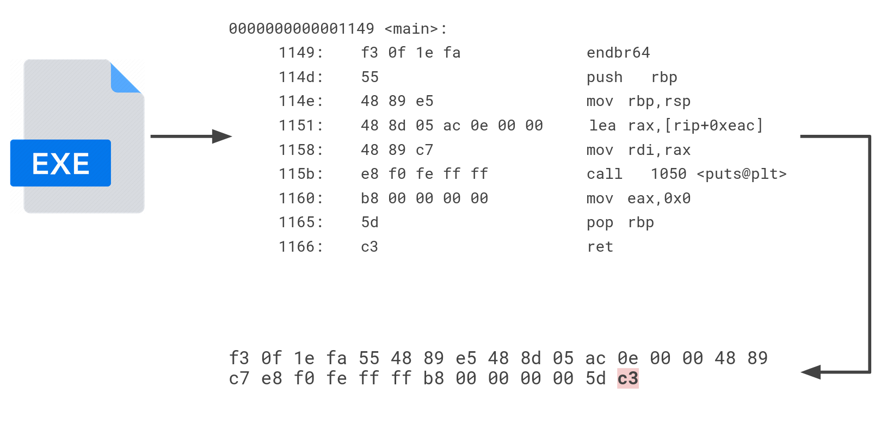
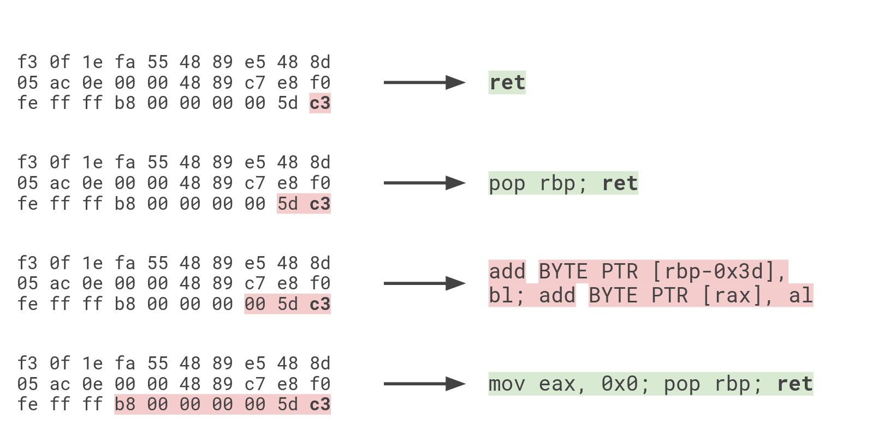
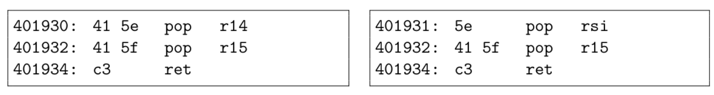
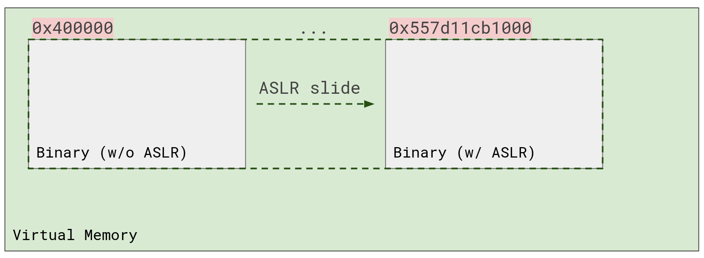

# Laboratory 0x03 - Code-reuse attacks (ret2libc & ROP)

Initial memory corruption exploits relied on shellcode injection. Back in the day, the stack used to be executable memory. After the introduction of the [NX bit](https://en.wikipedia.org/wiki/NX_bit), attacks evolved into a different direction. The NX bit basically set the standard for memory segments to have permissions according to their needs. The stack segment only needs to be read from and written to, but not to be executed from. Therefore, the introduction of the NX bit killed shellcode injection attacks... for *a while*.

Attackers came up with the perfect solutions to the defending mechanisms - if we cannot inject arbitrary code, why not just *reuse* code that is already there?! We have actually done this ourselves in the previous laboratory, we have reused functions inside the program that were left there, but never called. However, that seems like a minuscule attack surface. Especially considering the functions should be completely benign! How could an attacker get a shell, or do *anything* useful with those functions? Well...


**[Q1]**: Where are these hundreds of functions?

Remember the virtual memory mapping we have seen in the first lab? Remember how linked *libraries* are also mapped into the same *process virtual memory space*? Yeah, free real estate!

```
60f98638b000-60f98638d000 r--p 00000000 08:02 133527                     /usr/bin/cat
60f98638d000-60f986391000 r-xp 00002000 08:02 133527                     /usr/bin/cat
60f986391000-60f986393000 r--p 00006000 08:02 133527                     /usr/bin/cat
60f986393000-60f986394000 r--p 00007000 08:02 133527                     /usr/bin/cat
60f986394000-60f986395000 rw-p 00008000 08:02 133527                     /usr/bin/cat
60f9bf407000-60f9bf428000 rw-p 00000000 00:00 0                          [heap]
789e53600000-789e54506000 r--p 00000000 08:02 263037                     /usr/lib/locale/locale-archive
789e54600000-789e54628000 r--p 00000000 08:02 657762                     /usr/lib/x86_64-linux-gnu/libc.so.6
789e54628000-789e547bd000 r-xp 00028000 08:02 657762                     /usr/lib/x86_64-linux-gnu/libc.so.6
789e547bd000-789e54815000 r--p 001bd000 08:02 657762                     /usr/lib/x86_64-linux-gnu/libc.so.6
789e54815000-789e54816000 ---p 00215000 08:02 657762                     /usr/lib/x86_64-linux-gnu/libc.so.6
789e54816000-789e5481a000 r--p 00215000 08:02 657762                     /usr/lib/x86_64-linux-gnu/libc.so.6
789e5481a000-789e5481c000 rw-p 00219000 08:02 657762                     /usr/lib/x86_64-linux-gnu/libc.so.6
789e5481c000-789e54829000 rw-p 00000000 00:00 0 
789e5484a000-789e5486f000 rw-p 00000000 00:00 0 
789e5488f000-789e54891000 rw-p 00000000 00:00 0 
789e54891000-789e54895000 r--p 00000000 00:00 0                          [vvar]
789e54895000-789e54897000 r-xp 00000000 00:00 0                          [vdso]
789e54897000-789e54899000 r--p 00000000 08:02 657758                     /usr/lib/x86_64-linux-gnu/ld-linux-x86-64.so.2
789e54899000-789e548c3000 r-xp 00002000 08:02 657758                     /usr/lib/x86_64-linux-gnu/ld-linux-x86-64.so.2
789e548c3000-789e548ce000 r--p 0002c000 08:02 657758                     /usr/lib/x86_64-linux-gnu/ld-linux-x86-64.so.2
789e548cf000-789e548d1000 r--p 00037000 08:02 657758                     /usr/lib/x86_64-linux-gnu/ld-linux-x86-64.so.2
789e548d1000-789e548d3000 rw-p 00039000 08:02 657758                     /usr/lib/x86_64-linux-gnu/ld-linux-x86-64.so.2
7ffc069c9000-7ffc069ea000 rw-p 00000000 00:00 0                          [stack]
ffffffffff600000-ffffffffff601000 --xp 00000000 00:00 0                  [vsyscall]
```

There is only one problem with this - *Address Space Layout Randomization* (or ASLR). Code reuse attacks that use the standard C library (also known as *ret2libc attacks*) have spawned yet another mitigation. This time implemented on an entire system, in the kernel, ASLR randomizes the address where binaries get mapped at. Basically, at every run of a program, libc's starting point will be found at a different address. This applies for the stack segment, the heap segment, other libraries, user-defined mmap segments and *even the user binary* itself, given the program is compiled as a [Position Independent Executable (PIE)](https://en.wikipedia.org/wiki/Position-independent_code). We will learn how to bypass this in later labs. In this lab, we will be temporarily disabling ASLR.

Check out the `../util/toggle-aslr.sh` shell script. It will toggle ASLR on your system when you run it. Running it once will disable it, running it again will re-enable it. We can use it to play around and inspect the virtual memory. You don't really need to worry about forgetting to turn ASLR back on, it will turn itself back on after a restart.

## Exercise 1 - .hidden airlines

For exercise 1 we have a flying course, courtesy of *.hidden airlines*. Also, they don't really provide uh... landing instructions. Once you're up in the air, it's up to you to *return* to land.

Anyways, check your booking information in `ex1.c`. I am not sure you have a ticket.

**[Q2]**: Explore the program. What does it do? Where is the vulnerability?

**[Q3]**: How does ret2libc fit into this? What are some nice libc functions for exploitation?

**[Q4]**: Can we get a shell with this program? How?

Write a *pwntools* exploit to get a shell on `ex1`.

**Hints**:

* Think very carefully about *what* you control.
* Source code is misleading, use the debugger to confirm program states.
* Always keep the calling convention in mind!
* This one might be a bit hard, but don't give up! Ask for help if it feels impossible. Theorycraft with your colleagues, come up with ideas.

## Exercise 2 - Glade of Dreams

For this exercise, please make sure you turn ASLR back **on**. This is so we cannot directly use libc functions. The program will not be compiled as PIE, meaning program addresses will not be affected by ASLR regardless.

Additionally, for this exercise, we will require to dump ROP gadgets from a binary. ROP gadgets are small sequences of instructions that are either composed of only some of the instructions in a function, or entirely new instructions found in *between* the cracks of the real ones. They are found by trying to decode instructions backwards from a `0xc3` byte, which is the opcode for the `ret` instruction. The illustrations below show the process of discovering ROP gadgets:





Sometimes, when grabbing only a few bytes from a real instruction, entirely new instructions are generated. See the example below. Note how the right side image starts decoding the instructions one byte later, resulting in a `pop rsi` that was not present in the original program.



To dump ROP gadgets from a binary, I personally recommend [ROPGadget](https://github.com/JonathanSalwan/ROPgadget), but really any dumper probably works. Another example is [ropper](https://github.com/sashs/Ropper), which can also be used in pwndbg:

```
pwndbg> ropper -- --search 'pop rbp'
[INFO] Load gadgets from cache
[LOAD] loading... 100%
[LOAD] removing double gadgets... 100%
[INFO] Searching for gadgets: pop rbp

[INFO] File: /home/costinteo/Programming/osds-lab/lab3/bin/ex2
0x000000000040115d: pop rbp; ret;
```

We can use ROP gadget addresses as return addresses and chain them to achieve arbitrary computation.

Now, for the exercise.

**[Q5]**: Explore the program. What does it do? Where is the vulnerability?

**[Q6]**: Dump the ROP gadgets from the binary. Look at them and think which might be useful and why.

**[Q7]**: How would you call `dream_msg()` with one of the strings in the binary using a ROP chain? Try it.

**[Q8]**: How do you get a shell?

Write a pwntools exploit to get a shell.

**Hints**:

* Always keep the calling convention in mind!
* Some parts of the program can be red herrings. But they could give you ideas of how to exploit it.
* The `__attribute__` mess is really there so the compiler can generate some specific ROP gadgets.
* Ask for help if stuck.

## Extra Challenges

Each lab will also have some extra fun challenges that expand on each exercise, to give you an opportunity to explore more for an exercise you liked. You can get extra points for them. Here are the challenges for this lab:

1. **Address Space Who?** -- How would we be able to defeat ASLR? Compare libc function addresses when ASLR is on and when it is off, on multiple runs. Notice anything interesting (see pic below)? Can you solve "Glade of Dreams" with ASLR on?
2. **ROP Overdose** -- Try your ROP skills against `bonus`. It is a real CTF challenge and it should be quite fun, as it requires more interesting chains than the ones we've done. I recommend using Ghidra, IDA or Binary Ninja to decompile it.


