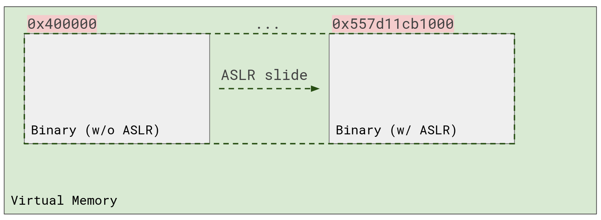

# Laboratory 0x04 - Bypassing Mitigations

As a response to the buffer overflow problem, numerous mitigations have been implemented. However, no solution was able to completely stop it. Some of the solutions implemented are done at compilation, such as the addition of stack *cookies* or *canaries*. The kernel is also a common place to add mitigation mechanisms to, for example the *NX bit* - where segments permissions are marked by the kernel. One other important mitigation that we've seen before is ASLR - Address Space Layout Randomization.

* Nowadays the [NX bit](https://en.wikipedia.org/wiki/NX_bit) has hardware level support. The bit is set in paging structures by the kernel and on address translations (virtual memory to RAM) the CPU will refuse to fetch executable instructions from the page if the *NX bit* is set.
* A stack canary is a random value, generated at the beginning of program execution. For each *protected function*, the compiler will add instructions in the function prologue to get this random value from the memory and place it on the stack, usually before the return address (but this is implementation-defined). Then, at function epilogue, before the `ret` instruction, the value of the stack cookie is checked against the *global* value. If they do not match - usually meaning the stack has been corrupted - the function calls `exit` instead, which does not return. This effectively avoids using a corrupt return address.


* Adress Space Layout Randomization is a mechanism implemented in the kernel, which randomizes the initial mapping address of binaries. We've seen in the first lab how executables on disk are being mapped into virtual memory. The address an executable is loaded at (*base address*) is randomized by ASLR at each run. The linked libraries' *base address* is also randomized. ASLR can only randomize the base address of Position-Independent Executable (PIE).
* *Position Independence* is the property of code that allows it to be placed at any address in memory and still function properly. This is useful when shared libraries are loaded into memory and also allows ASLR to randomize the base address of any Position-Independent Executable. Position Independent Code uses only *relative addressing*, instead of *absolute addressing*. For example, an instruction like `jmp 0x404010` becomes `jmp RIP+0x42`. Since everything is relative to RIP and the offsets to other functions are the same and not randomized, relative-addressing will work the same and won't be influenced by the base address.



**[Q1]**: Knowing the interesting property above, what would be a weakness of ASLR?

In this lab, we shall learn to use ROP gadgets creatively, to leak and bypass ASLR. Additionally, we will analyze and use other *exploit primitives*, which will come in handy when combined with ROP.

Before starting, we should also take a brief dive into Global Offset Table (GOT) and the Procedure Linkage Table (PLT), two essential sections in an ELF file used to resolve imported functions to their address in case of *dynamically linked executables*. When an executable is compiled, the addresses to imported functions are not known. Instead of jumping to the real functions, execution first jumps to the PLT section. This section contains small stubs that jump to the real function by using pointers held in GOT. The GOT section holds pointers to the real functions, from the linked libraries. Initially, this section does not have pointers in it, but the linker fills it in at runtime, either at the beginning of execution, called *Eager Binding*, or once each function is called, called *Lazy Binding*. The next picture illustrates the concept of Lazy Binding.


Also, a diagram for Eager Binding is shown next:


## Exercise 1 - There and back again...

*Steal powerful ring, defeat dragon, return home, spawn ancient evil. I think that's how the book went, right?*

We do something like that here too. To defeat ASLR (*the dragon*), we need to *leak* an address (*the ring*). Because offsets to functions stay the same from the base address, we can use the leak to determine the base address where the executable was loaded.

For this first exercise, PIE will be disabled for the executable itself, but the libraries linked will have their base address **randomized**. Therefore, for the executable, the addresses we see at static analysis will be the same at runtime.
Please use `make ex1` to build the exercise.

**[Q2]**: Are there interesting functions you can jump to? Check out the full disassembly with `objdump -M intel -d ./bin/ex1`.

**[Q3]**: Try the `got` command in `pwndbg` and `gef`. It will show you the contents of the GOT section.
At the beginning of the binary, the imported functions should point to executable stubs in the binary that trigger the linker. After executing the imported functions once, the GOT section should contain their real, libc address.

Try stepping through the process to get a feeling about how it looks. Run `got` before the first `puts` call. Then step into `puts@plt` with `si`. Below is an excerpt from `pwndbg`, showing the path execution takes.

```
 ► 0x401050       <puts@plt>                        endbr64
   0x401054       <puts@plt+4>                      bnd jmp qword ptr [rip + 0x2fbd]   <0x401030> # <---- jump to GOT pointer for puts
    ↓
   0x401030                                         endbr64                                       # <---- initially points to stub triggering the linker
   0x401034                                         push   0                                      # <---- pushes the index of the function in GOT
   0x401039                                         bnd jmp 0x401020                   <0x401020> # <---- jumps to linker stub
    ↓
   0x401020                                         push   qword ptr [rip + 0x2fe2]
   0x401026                                         bnd jmp qword ptr [rip + 0x2fe3]   <_dl_runtime_resolve_xsavec> # <---- finally jumps to real linker code
    ↓
   0x7ffff7fd8d30 <_dl_runtime_resolve_xsavec>      endbr64
   0x7ffff7fd8d34 <_dl_runtime_resolve_xsavec+4>    push   rbx
   0x7ffff7fd8d35 <_dl_runtime_resolve_xsavec+5>    mov    rbx, rsp                    RBX => 0x7fffffffde30 ◂— 0
   0x7ffff7fd8d38 <_dl_runtime_resolve_xsavec+8>    and    rsp, 0xffffffffffffffc0     RSP => 0x7fffffffde00
```

Explore execution a bit. After the first run, `puts` jumps directly into libc, because the linker wrote its symbol to GOT:

```
 ► 0x401050       <puts@plt>      endbr64
   0x401054       <puts@plt+4>    bnd jmp qword ptr [rip + 0x2fbd]   <puts>
    ↓
   0x7ffff7c80e50 <puts>          endbr64
   0x7ffff7c80e54 <puts+4>        push   r14
   0x7ffff7c80e56 <puts+6>        push   r13
```

Try running the `got` command after the first `puts` call.

**[Q4]**: So the GOT contains addresses from inside imported libraries. How can we exploit this?

Write a *pwntools* exploit to get a shell on `ex1`.

**Hints**:

* The GOT section contains ASLR'd addresses. How can we use this?
* The program is very limited, how can we obtain more functionality?
* The `__attribute__` mess is really there so the compiler can generate some specific ROP gadgets.
* After leaking ASLR, the program will stop. Can we somehow exploit the same vuln twice in one run?

## Exercise 2 - You've GOT to be kidding me!

Ah, a binary with all protections activated! Just what the doctor ordered! Wait.. I think we forgot one.

Both `pwndbg` and `gef` have a `checksec` command, that shows you the current mitigations employed by the binary you've loaded. You can also use pwntools at the command line `$ pwn checksec FILE_NAME`. The mitigation `RelRO` is employed in the case of *Eager Binding*, where the linker fills in the GOT section at the beginning of a process and then marks it Read-Only. If *Lazy Binding* is employed instead...

Run `make ex2` to compile and check out `ex2.c`. This will be quite a puzzle, as it is pretty different than the previous ones.

**[Q5]**: Explore the program. What does it do? Where is the vulnerability?

**[Q6]**: Explore the flow of your input. What does it affect? Can you use it maliciously?

**[Q7]**: How do you get a shell?

Write a pwntools exploit to get a shell.

**Hints**:

* The vulnerability is a different class than usual.
* If you read leaks, try not to split on whitespace, you could be missing bytes.
* Read the `gets()` manual, there's a certain aspect of it that might ruin your exploit if you do not account for it.
* Don't forget how *Lazy Binding* works. Make sure you're leaking stuff right.
* Ask for help if you get very stuck, this might be quite difficult.

## Extra Challenges

Here are the extra challenges for this lab! Hope you have fun! The first one was contribution from local .hidden pwner, [BelgiNus](https://github.com/Stefan2320) (a.k.a Pinebel).

1. **I love cookies!** -- Try to get a shell in `cookies.c` without ***smashing the stack***. Eating cookies with a knife can be dangerous, but I think eating them with a fork can be risky too.
2. **Dude, just one byte, please!** -- This is how it feels when your friend only lets you take one bite of his deliciously-looking sandwich. Sure, you weren't hungry.. but after seeing that thing, who wouldn't be? Check out `bite.c`.
