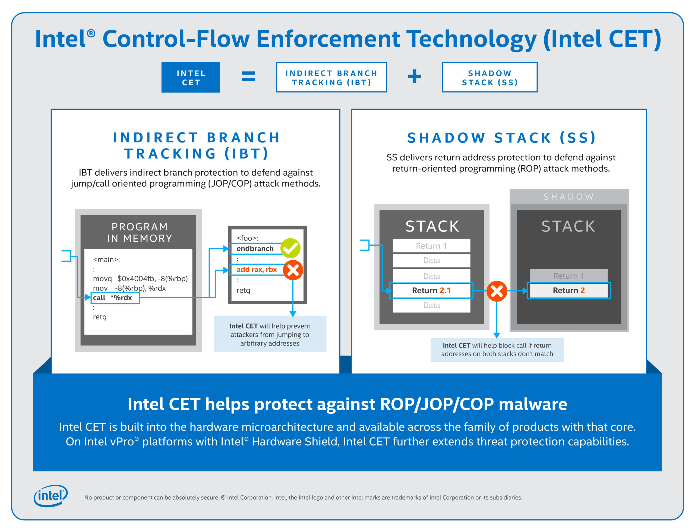
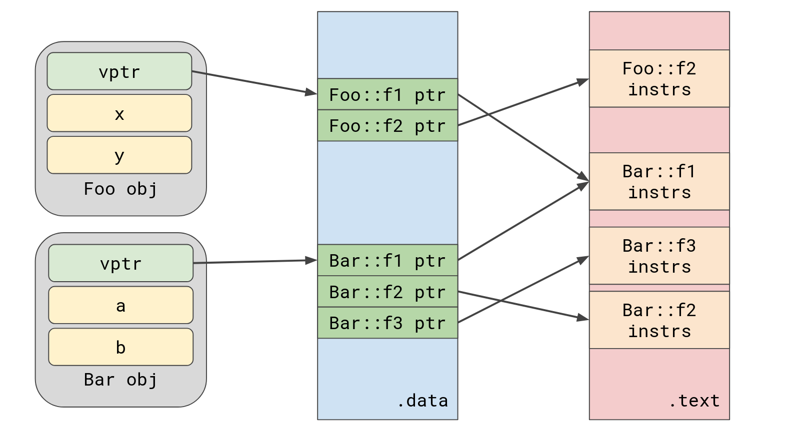

# Laboratory 0x05 - Bending RIP without ROP

Buffer overflows and Return Oriented Programming have been an issue for more than a decade. While numerous mitigations have been implemented to deter attacks using ROP, none have driven the technique extinct.
We've seen how these mitigations can be defeated in the previous lab.

There is one mitigation, however, that has the ability to stop ROP efficiently, which is *Control-Flow Integrity* (CFI). The concept was introduced in 2005, by **Abadi et al.** [[PDF](https://www.cs.columbia.edu/~suman/secure_sw_devel/p340-abadi.pdf)].
Essentially, it provided a way of checking the integrity of *data used directly for control-flow*, such as the *return addresses* found on the stack, or *function pointers* used for indirect calls.

However, as we can see in the paper, the mitigations added significant overhead to programs compiled with it. Which meant implementation of CFI measures were not adopted for quite a while, until hardware support for it has made it feasible. One of these hardware implementation is offered by Intel, in the form of Intel Control-flow Enforcement Technology (CET). The following is an illustration from promotional material for Intel CET.



There are two main components of CET:

* The Shadow Stack -- a copy of (only) the return addresses from the normal stack, that can only be interacted with through special instructions. Every time a `call` instruction is executed, the return address for it is pushed on both the stack and the shadow stack. On every `ret` instruction, the return addresses on both stacks are compared against each other. If they match, execution continues, otherwise the processor raises a fault.
* The Indirect Branch Tracker (IBT) -- used for indirect calls and jumps, which have a variable target, decided at runtime. Every time an indirect call or jump is executed, the processor enters a special state named `WAITING_FOR_ENDBRANCH`. If the next instruction is the newly added instruction `endbr64`, or `endbr32`, then execution continues normally and the processor returns to the state `IDLE`. If the next instruction is anything else, then the processor generates a fault. The newly added instruction is added by compilers at the beginning of every function, to mark it as a valid jump target for indirect control-flow transfers.

The above stops the corruption of return addresses and function pointers definitively... Or *does it*?

Intel CET hinders return address corruption greatly, as writing to the shadow stack is highly restrictive.
But buffer overflows can still corrupt *non-control-flow data*, such as variables stored on the stack, heap data, pointers, or even global data, leading to programs behaving in unexpected ways.
By finding ways to bend the execution of code without directly controlling RIP, we can create entirely new programs within programs. It's programs all the way down!

*Data-only Attacks* is the term used to describe a class of attacks where only data that does not directly change the control-flow of the program is corrupted.
By discovering generic classes of sequences of instructions, we can start chaining them in certain ways by corrupting only non-control-flow data.
The following didactic code snippet illustrates the concept.

```c
void func() {
	char *ptr = MESSAGE_PTR;
	char buf[16];
	gets(buf);    // vulnerable
	printf("%s\n", ptr);
	return;
}
```

The code is simple, `buf` can be overflown through the `gets()` function call. When CFI is enforced, this overflow won't be able to control RIP.
But it gives attackers a powerful arbitrary read primitive, by allowing them to overwrite the initial `ptr` pointer with any address they wish, instead of the initial value, `MESSAGE_PTR`.=
Thus the integrity of the shadow stack is preserved, but exploitation still occurs. The expressiveness of such attacks is discussed by **Hu et al.** [[PDF](https://www.comp.nus.edu.sg/~prateeks/papers/DOP-TC.pdf)].

Similarly, the IBT component of CET implements very *coarse-grained* control-flow integrity mechanisms - allowing any indirect control-flow transfer to land at the beginning of any marked function.
This means that, although addresses to ROP gadgets cannot be used any longer to overwrite function pointers, corruption can still lead to arbitrary function calls, because all functions start with the newly-added `endbr64`, or `endbr32` instructions.
Techniques in which exploitation chains function calls, instead of ROP gadgets, exist. In modern academic research, such techniques make notable appearances in papers such as the one by **Schuster et al.** [[PDF](https://ieeexplore.ieee.org/stamp/stamp.jsp?tp=&arnumber=7163058)], titled _Counterfeit Object-Oriented Programming_, or articles such as the one published in _Phrack_ Volume 0x10, Issue 0x47, by **LMS**, [[LINK](https://phrack.org/issues/71/7.html#article)], titled _Bypassing CET & BTI With Functional Oriented Programming_.

**IMPORTANT!** For the exercises in this lab, we will be bypassing Intel CET with techniques listed above. Since not everyone has the hardware capability for Intel CET and the operating system support for CET is limited as of writing this, we'll be using the [_Intel Software Development Emulator_](https://www.intel.com/content/www/us/en/download/684897/intel-software-development-emulator.html). You can download it and unpack it through the UI, or with the following commands. Note that versions for the emulator might change, and links might die. Use the UI if the method below stops working.

```
$ wget https://downloadmirror.intel.com/831748/sde-external-9.44.0-2024-08-22-lin.tar.xz
$ tar xf sde-external-9.44.0-2024-08-22-lin.tar.xz
$ mv sde-external-9.44.0-2024-08-22-lin sdekit
```

**VERY IMPORTANT!** Every time you work with an exercise at this particular lab, you should be using the emulator to open the program with emulated CET protections, as such:

```
$ ./sdekit/sde64 -no-follow-child -cet -cet_output_file /dev/null -- ./bin/ex1
```

When writing the pwntools script, use the same command line. Here is a template:

```py
!/usr/bin/env python3
from pwn import *

target = process("./sdekit/sde64 -no-follow-child -cet -cet_output_file /dev/null -- ./bin/ex1", shell=True)

# exploit the world here
```

## Exercise 1 - Doctor's Weird Appointments

_There's a bunch of weird appointments coming in the doctor's office, but priority is hard to establish. Can you look over them and see which is more important?_

Please use `make ex1` to build the exercise. Use the Intel SDE to run the binary (see important notices above).

Intel CET is enabled for this binary, which means buffer overflows won't be able to hijack return addresses. 


**[Q1]**: Where is the vulnerability? What data can be controlled on the stack using it?

**[Q2]**: Can we achieve any interesting capability/primitive by manipulating any of the data?

**[Q3]**: What function is especially interesting in the program? How can we call it legitimately?

Write a *pwntools* exploit to get a shell on `ex1`.

**Hints**:

* Data on the stack has different types. Learn how those types are manipulated at lower level, in the assembly.
* You're going to need a leak of heap, because it's randomized by ASLR. You can reliably find positions of objects on the heap given deterministic program traces.
Basically, if a program runs the same way every time, then objects on the heap will be found at the same offsets.
* Use the `heap chunks` command to see heap chunks. You can also _examine_ their contents using the gdb `x/...` (examine) command.
The `gef` plugin has some nicer visualization for heap chunks, but you can just use the examine command to get the same on `pwndbg`.
* There is data on the stack that cannot be seen in the source code. Figure out if you can use that to get where you want.

## Exercise 2 - Counterfeit Employee Oriented Projects?

_Check out Stack Overflow for code? What, do I look like I copy other people's work? That's counterfeiting. Why do that when you can just ask an LLM to generate it?_

For this exercise, you need to properly understand how C++ virtual tables look like once compiled into an ELF file. An illustration (greatly inspired by [this](https://guihao-liang.github.io/img/lang/cpp/vtable-part-1.png)) for this purpose is shown below:



Objects are stored in memory with all their fields in order, as they appear in the class definition. However, a `vtable` pointer is stored at the beginning of every object in memory.
The pointer stores the location of the virtual table for that particular class of objects. When a virtual method is called, the assembly will generate an indirect call such as `call rax`.
Before it, `rax` will most likely be assigned the value of this `vtable` pointer, _plus_ some offset, that leads to the correct function.

For example, if I call `foo::f2()`, the generated assembly will look something like this:

```
lea rdi, [rbp - 0x10]   ; load the object addr somewhere from the stack into rdi
                        ; rdi will now be pointing directly to the object's beginning
mov rax, [rdi]          ; move vptr into rax
add rax, 0x08           ; add the offset to the desired function
                        ; f2 is found at offset 0x08 from the beginning of the vtable
call rax                ; call f2
```

Of course, the above is simplified quite a lot, but the idea is the same in real programs. For more information on this, I recommend reading the following two articles:

* [Understand C++ vtable from assembly code](https://guihao-liang.github.io/2020/05/30/what-is-vtable-in-cpp)
* [Exploiting C++ VTABLES: Instance Replacement](https://defuse.ca/exploiting-cpp-vtables.htm)

If we can figure out a way to corrupt the vtable pointer, we can point it somewhere else.
Thus, when the indirect call target is resolved above, it can resolve to any other function in the vtable.

Run `make ex2` to build the exercise. Use the Intel SDE to run the binary (see important notices above).

Intel CET is enabled for this binary, which means all indirect call targets have to point correctly to the beginning of a function.
Using COOP, it is guaranteed that this restriction will be respected.

**[Q4]**: Explore the program. What does it do? Where is the vulnerability?

**[Q5]**: The vulnerability affects a different part of memory than usual. Can you figure out what can be corrupted on there?

**[Q6]**: Using the concepts illustrated in the _Counterfeit Object-Oriented Programming_ paper, how can we get a shell?

Write a pwntools exploit to get a shell.

**Hints**:

* Read the paper. Link in the introduction of this lab.
* Check the [slides](https://docs.google.com/presentation/d/1uVpV-RMxSOrWgWnhoMTHsLhiAM6Vpz8DGrt0YNHeQcY/edit?usp=sharing) from the course.
* Heap chunks contain metadata that is used by the allocator.
If your overflow crashes the program, make sure you don't overwrite values right before the chunks.
Keep the same values for the metadata as seen at runtime.
* There's an extra "challenge" once you manage to call `system()`. Figure out how the input to `system()` can be exploited.
* Might be quite hard, ask for hints if you get stuck.

## Extra Challenges

Since exercises for this lab are very specialized, there is only one bonus challenge for it.
It's not a very realistic challenge, but it's a very small puzzle based on data-only attacks.
Try to figure out a way to get a shell. Any means are allowed.

Check out `puzzle.c` for it.
