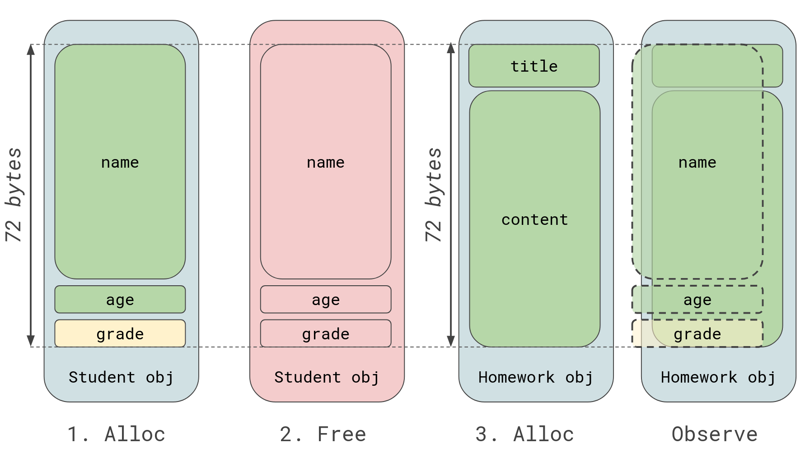

# Laboratory 0x06 - Heap Allocators

We've talked _a lot_ about stack buffer overflows in the previous labs. Although, with lab 5, we've been given a brutal introduction into the **heap**. In fact, exercise 2 even contains a heap buffer overflow that we use in the exploit.

The heap is another memory segment, like the stack, that is used non-contiguously. We've seen the heap memory segment before when inspecting `vmmap` output in the debugger.
Unlike the stack, for which the memory management is done by compiler-generated instructions, the heap is managed, simplistically, through a pair of functions:

* `allocate` - a function that allocates memory (`malloc` in the case of libc)
* `free` - a function that _frees_ memory (`free` in libc)

These functions can be used by the programmer as they see fit. However, notice that these are entire _functions_, provided by a _library_.
How heap memory is managed depends on the implementation of the heap provider. For example, `malloc` will behave differently depending where it comes from, libc, or another library.
Kernel memory is also allocated differently, as the kernel uses a special heap implementation. Windows also has a different heap implementation than Linux.

What does *heap implementation* mean? The code that is responsible for implementing `malloc`, `free` and other functions that can be used to interact with the heap is what we conside the *heap implementation*.
We can also refer to it as the *heap allocator*. The implementation defines how allocating memory and freeing it looks in the segment of memory established for the heap.
Usually, heap allocators use data structures such as linked lists to manage chunks of allocated memory.

For a great article on the heap, I recommend [Exploiting the Heap](https://www.bencode.net/posts/2019-10-19-heap-overflow/), by Ben Simmonds. Additionally, Azeria has a [2-part series on the Glibc heap](https://azeria-labs.com/heap-exploitation-part-1-understanding-the-glibc-heap-implementation/).
I **highly** recommend reading at least one of them before doing the lab.

Of course, because heap implementations change from one system to the other, this lab will try to remain as agnostic as possible. We will look into some common vulnerability classes found in allocators throughout implementations.

In this lab, we will deal with two vulnerability classes: Use-After-Free and Heap Overflows.
I recommend reading about the rest in the articles above.

### Use-After-Free

A use-after-free vulnerability is exactly what it sounds like! After freeing an object from the heap, the code uses it again as if it hasn't been freed.
Heap implementations work on the same segment of memory, so after freeing a chunk, that chunk can be allocated again.

Here is an example - we have a class `Student` and a class `Homework`:

```c
struct Student {
	char name[64];
	int age;
	int grade;
};

struct Homework {
	char title[16];
	char content[56];
};
```

Imagine objects of both are allocated on the heap. If a `Student` object is allocated on the heap, it will take `64 + 4 + 4 = 72` bytes of memory. The `Homework` object takes `16 + 56 = 72` bytes of memory.
We can imagine that a student can input their `name` and their `age`, but not their `grade`, that should be decided by the teachers.
Additionally, a student can turn in homework, where they can input both the `title` and the `content`.

If a `Student` object is allocated on the heap and then freed, the next object that gets allocated on the heap (depending on implementations) will take its spot.
Usually, to reuse the chunk, the object has to be of the same size or less than the chunk to be reused, so it can fit in.
So if a student turns in homework after the `Student` object got freed, the `Homework` object will take its chunk.
Because the `Homework` object has more user-controlled bytes (72 instead of 68), if this chunk is interpreted as a `Student` instead of a `Homework` object, then the `grade` field can be modified.



Notice how, because `Homework` has more bytes that can be written by the user, we can change the `grade` because of it overlapping with `content`.
If the code accesses the `Student` object's grade, without it realizing the object has been freed and has now been hijacked, operations based on the `grade` field (such as seeing if the student has passed) are compromised.

### Heap Overflow

A heap overflow vulnerability is a buffer overflow, but on the heap. The overflown data overwrites the heap chunks.
We have already experienced a heap overflow in Lab 5, Exercise 2.

Depending on the extent of the overflow, they can prove to be powerful primitives for exploitation.
It is often that the heap contains pointers on which read/write operations are performed, or function pointers.

## Exercise 1 - .hidden notes v2.0

*Hey thanks for finding those vulns in the first version! We improved a lot thanks to you!*

Please use `make ex1` to build the exercise.

**[Q1]**: What type of objects can we allocate on the heap? What size are they?

**[Q2]**: What type of vulnerability can you notice?

**[Q3]**: Can we overwrite interesting data from one class and then use it?

Write a *pwntools* exploit to get a shell on `ex1`.

**Hints**:

* Identify the control you have over the heap. Where is you allocation primitive, or your free primitive?
* Use `heap chunks` in gef, or `heap` in pwndbg to see your chunks. The gef heap commands are slightly nicer to look at.
* Observe the addresses returned by `malloc`, see when the addresses are the same.

## Exercise 2 - Metin 2 Text Adventure

Challenge was contributed by [zenbassi](https://github.com/stefan-radu).

Title is self-explanatory. Find the vuln, get the Metin stone.

Run `make ex2` to build the exercise.

**[Q4]**: Find the vulnerable function. Where does it write?

**[Q5]**: What can you overwrite with it? Can you achieve a more powerful primitive?

**[Q6]**: You've got a shell before using such a powerful primitive. What is a good target for arbitrary writes?

Write a pwntools exploit to get a shell.

**Hints**:

* Heap chunks contain metadata that is used by the allocator.
If your overflow crashes the program because of the heap, make sure you don't overwrite values right before the chunks.
Keep the same values for the metadata as seen at runtime. *Sometimes it works with corrupted values as well though*.

## Extra Challenges

Coding challenge for this one:

1. **Contribute to Open-Source Software!** -- Do you like contributing? Did you see how `gef` has nice heap chunk visualization and `pwndbg` does not also print the content? How about porting that functionality over? `pwndbg` is very friendly to new contributors and this feature should be quite straight-forward and easy to do. Give me a message if you are unsure how to start!
